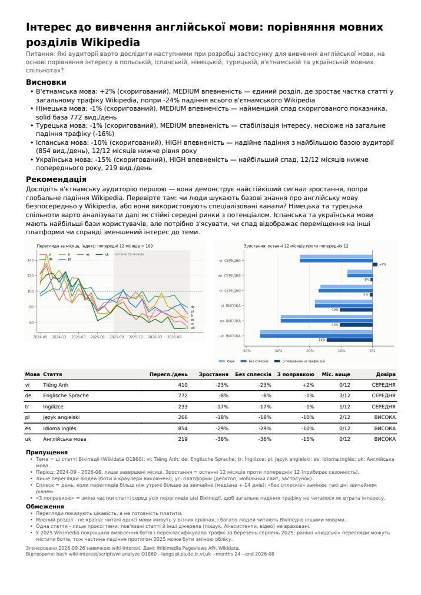

# wiki-interest: навичка для AI-агента

Навичка у форматі [Agent Skills](https://agentskills.io/specification). Вона відповідає на питання «чи зростає інтерес до теми і в яких мовах» за даними [переглядів Wikipedia](https://doc.wikimedia.org/generated-data-platform/aqs/analytics-api/reference/page-views.html). Результат: таблиця метрик із рівнем довіри, два графіки та PDF на одну сторінку.

Уся навичка лежить у папці [wiki-interest/](wiki-interest/).

## Швидкий старт

Потрібно: `bash`, Python 3.10+, інтернет. Команди нижче запускаються з кореня репозиторію.

**Як навичка для Claude Code** (2.x):

```bash
mkdir -p ~/.claude/skills
cp -r wiki-interest ~/.claude/skills/
```

Далі просто запитайте агента, наприклад: «Чи зростає інтерес до астрономії в україномовній Вікіпедії?». Інші агенти, що підтримують Agent Skills, підключають папку `wiki-interest/` так само.

**Вручну, без агента:**

```bash
bash wiki-interest/scripts/wi find "астрономія" --langs uk --query-lang uk
bash wiki-interest/scripts/wi analyze Q333 --langs uk
```

Перший запуск сам створює `wiki-interest/.venv` і ставить залежності (`matplotlib`, `fpdf2`, `uharfbuzz`, 1–2 хв). Результати пишуться в `./wiki-research/`.

**Тести:**

```bash
cd wiki-interest
bash scripts/wi --help
.venv/bin/python -m unittest discover -s tests
```

## Як це працює

Три команди. Кожна робить цілий крок і друкує стисле зведення, тож агенту на дешевій моделі не треба писати код чи розбирати сирі дані.

| Команда | Що робить |
|---|---|
| `find "тема" --langs pl,cs --query-lang uk` | Шукає тему будь-якою мовою у Wikidata, показує назву статті в кожній мові. Якщо статті немає, пише `MISSING` і пропонує схожі, але нічого не вигадує. Перевіряє коди мов і підказує правильний. |
| `analyze Q1666254 --langs pl,cs` | Бере останні ≥24 завершені місяці, рахує метрики, рівень довіри, рейтинг мов, будує 2 графіки. Друкує команду для повтору, щоб уточнення коштувало одного параметра. |
| `report <run> --findings findings.md --lang uk` | Верстає PDF на 1 сторінку: висновки агента + таблиця, графіки, припущення й обмеження з даних. Якщо число у висновках не збігається з даними, PDF не створюється. Надписи 14 мовами (en, uk, pl, cs, de, es, fr, pt, tr, vi, ja, zh, ar, hi), для решти англійська. |

Метрики для кожної мови (деталі й пороги: [methodology.md](wiki-interest/references/methodology.md)):

- **Зростання:** останні 12 місяців проти попередніх 12. Порівнюються ті самі календарні місяці, тож сезонність зникає.
- **Без сплесків:** дні з новинним ажіотажем (у 3 рази вище звичайного) замінюються звичайним рівнем.
- **З поправкою на трафік вікі:** зміна частки статті серед усіх переглядів цієї Вікіпедії. Це головний сигнал, бо загальний трафік Wikipedia падає.
- **Довіра HIGH/MEDIUM/LOW з причинами.** Її рахує код, а не модель: обсяг переглядів, стабільність по місяцях, чи тримається зростання без сплесків і після поправки.
- **Рейтинг:** за зростанням з поправкою, LOW внизу. Користувач може змінити критерій (`--sort volume`).
- **Рік до року:** з `--months 36` і більше кожен рік порівнюється з попереднім, а код ставить мітку `improving / worsening / about the same`.

### Ключові рішення

- **Логіку рахує код, модель лише інтерпретує.** Рівень довіри, рейтинг, обмеження й звірку чисел рахують скрипти, а обов'язкові застереження друкує сам `analyze`. Пробний прогін показав, що Haiku краще виконує вивід команди, ніж правила в SKILL.md.
- **Жодних вигаданих статей.** Мапінг мов іде через Wikidata. Перший приклад із завдання впирається саме в це: у польській Вікіпедії статті про інтервальне голодування немає.
- **Кеш у файлах.** Завершені місяці не змінюються, тому повторні й уточнені запити не звертаються до API.
- **Python + 3 залежності** (`matplotlib`, `fpdf2`, `uharfbuzz`). Версії закріплені й ставляться на Python 3.10–3.14. Скомпільованих файлів у репозиторії немає.
- **Будь-яке письмо в PDF без роздування репозиторію.** Шрифти Noto для ієрогліфів, арабського письма, івриту, деванагарі, бенгальської й тайської `report` завантажує лише тоді, коли вони потрібні. Джерело закріплене на конкретному коміті й перевіряється за SHA-256. Арабське письмо й деванагарі розкладаються через HarfBuzz, арабський звіт вирівнюється праворуч.

## Як я перевіряв (у т.ч. код, написаний з AI)

1. **Незалежна звірка чисел.** Наші місячні суми порівняно з окремим місячним ендпоінтом Wikimedia (ті самі дані, що в pageviews.wmcloud.org): 6 мов × 24 місяці, **0 розбіжностей**.
2. **Юніт-тести (33)** на штучних рядах із відомою відповіддю: зростання, сплеск, сезонність, мало даних, стаття з'явилася посеред періоду, падіння всієї вікі, рік до року на 36 місяцях, рейтинг, звірка чисел (включно з арабськими й повноширинними цифрами), markdown від моделі, повнота перекладів 14 мов, вибір шрифту за письмом, PDF рівно на 1 сторінку українською, англійською, японською й арабською.
3. **Графіки й PDF переглянуто очима.** Так знайдено й виправлено накладання легенди та підписів. Палітру перевірено валідатором кольорів на доступність для дальтоніків.
4. **Формат навички** перевірено офіційним валідатором: `pip install skills-ref`, потім `agentskills validate wiki-interest` → `Valid skill`.
5. **Прогони на Haiku 4.5** через Claude Code: запити із завдання дослівно, уточнення і запит польською ([prompts.md](wiki-interest/evals/prompts.md), [RESULTS.md](wiki-interest/evals/RESULTS.md)). 23 прогони в 7 раундів, разом $1.60, включно із запитами японською й арабською. Одне питання займає 22–61 с і 1–6 викликів. Після кожного раунду я читав транскрипти, виправляв навичку і проганяв знову:
   - **Підміна теми.** Коли статті не було, модель підставляла ширшу («піст» замість «інтервального голодування»). Тепер заборона стоїть прямо у виводі `find`.
   - **Мова як країна, вигадані числа.** Модель називала мовні розділи країнами і вигадала суму переглядів. Тепер таблиця показує назву мовного розділу, а `analyze` друкує шаблон відповіді.
   - **Вада продукту в уточненні «візьми 3 роки».** Цифри не змінювалися, і модель робила хибний висновок. Тепер з'явилася динаміка рік до року з мітками, які ставить код.
   - **Лишилось:** на найширшому прикладі 3 відповідь у чаті іноді додає причини, яких немає в даних. PDF від цього захищений звіркою чисел і автоматичними обмеженнями.

Помилки, знайдені під час перевірки:
- **Рейтинг за замовчуванням** спершу ставив мову з упевненим падінням вище за мову, де інтерес тримається. Виправлено й покрито тестом.
- **Падіння трафіку.** Для статті «Астрономія» в uk трафік людей упав на 60%, а трафік, позначений як боти, подвоївся. Причина: Wikimedia у 2025 перекласифікувала ботів ([джерело](https://diff.wikimedia.org/2025/10/17/new-user-trends-on-wikipedia/)). Тепер це обмеження автоматично потрапляє в кожен звіт.

## Приклади

PDF, який Haiku 4.5 сам згенерував на приклад 3 із завдання ([PDF](wiki-interest/evals/examples/ex3-english-learning-report.pdf), [findings.md](wiki-interest/evals/examples/ex3-findings.md)):



Той самий формат арабською, справа наліво ([PDF](wiki-interest/evals/examples/ar-astronomy-report.pdf)): звіт Haiku на запит арабською.

## Обмеження

- Перегляди показують цікавість, а не готовність платити.
- Мовний розділ не дорівнює країні.
- Одна стаття лише наближено відображає тему. Для широких намірів («вивчення англійської») SKILL.md просить аналізувати 2–3 статті, але Haiku зробив це лише в 1 з 5 прогонів. Надійне рішення: «кошик» статей в одному аналізі (див. нижче).
- Перегляди через редиректи (старі назви) не додаються. Перейменування посеред періоду дає довіру LOW.
- Надписи PDF є для 14 мов, для решти англійська. Переклади зроблено з AI і не перевірено носіями мов. Графіки мовою звіту лише для латиниці й кирилиці, для інших письмен англійською, бо matplotlib не розкладає арабське письмо й деванагарі. Для ієрогліфів і арабського письма потрібен інтернет при першому звіті (завантаження шрифту).

## Як розвивати далі

1. **Більше тестових запитів.** Регулярно проганяти їх на дешевій моделі після кожної зміни SKILL.md, стежити за кількістю викликів і вартістю.
2. **Теми з кількох статей.** «Кошик» статей через Wikidata (підкласи, пов'язані поняття) і категорії, сума й розбивка в одному аналізі.
3. **Великі обсяги.** Замість API для кожної статті брати [bulk-дампи переглядів](https://dumps.wikimedia.org/other/pageview_complete/) у Parquet + DuckDB. Тоді можна за хвилини проглядати всі ~350 Вікіпедій і тисячі статей.
4. **Ринок, а не мова.** Дані переглядів за країнами, кількість мовців, інтернет-аудиторія, купівельна спроможність.
5. **Інші сигнали.** Google Trends, запити в app stores, соцмережі, бо інтерес у Вікіпедії не дорівнює готовності платити.
6. **Аналітика.** Декомпозиція сезонності на рядах від 3 років, детекція точок зміни тренду, підписи новинних подій на графіку.
7. **Графіки будь-якою мовою.** Розкладка арабського письма й деванагарі в matplotlib або малювання графіків разом із текстом у PDF. Переклади надписів перевірити з носіями мов.
8. **Перевірка відповіді в чаті.** Команда `check`, яка проганяє ту саму звірку чисел і обов'язкових обмежень, що й для PDF, або hook, що запускає її перед відповіддю.

## Структура

```
wiki-interest/
├── SKILL.md                  інструкції для агента
├── requirements.txt          закріплені залежності
├── scripts/
│   ├── wi                    точка входу, сама створює .venv
│   ├── wi.py                 команди find / analyze / report
│   ├── wikiapi.py            Wikimedia API + кеш
│   ├── metrics.py            метрики, довіра, рейтинг
│   ├── render.py             графіки, PDF, звірка чисел
│   ├── fonts.py              шрифти Noto для інших письмен (завантаження за потреби)
│   ├── i18n.py               завантаження надписів
│   └── locales/              надписи PDF 14 мовами
├── references/methodology.md метрики, пороги, обмеження
├── tests/                    юніт-тести
└── evals/                    тестові запити, скрипт прогону, результати, приклади
```
